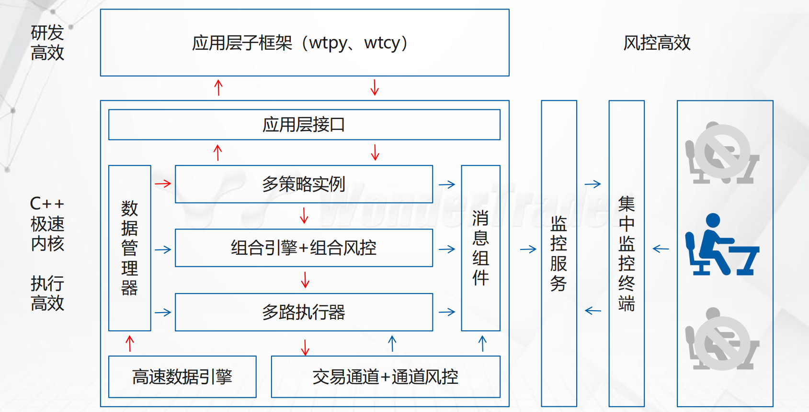
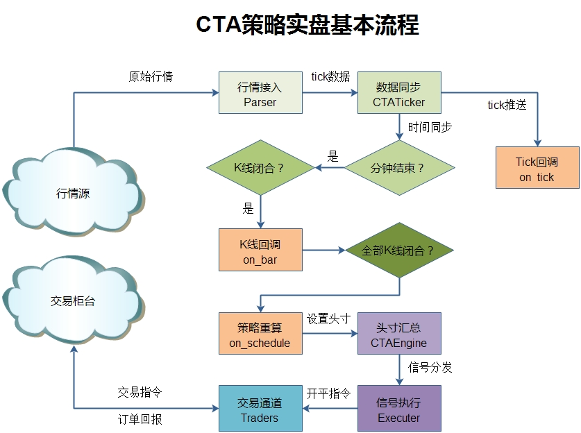
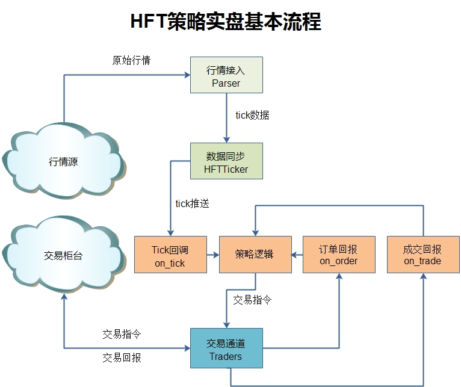
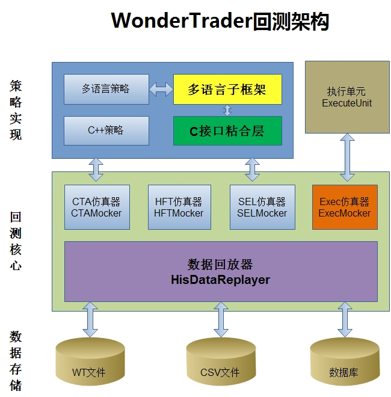
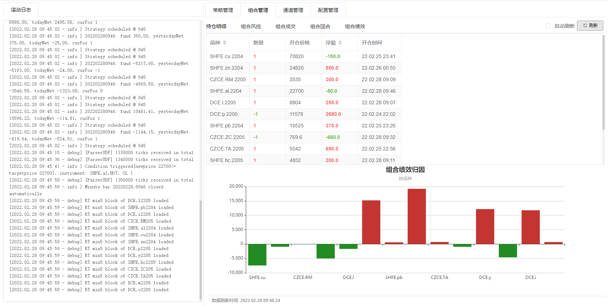
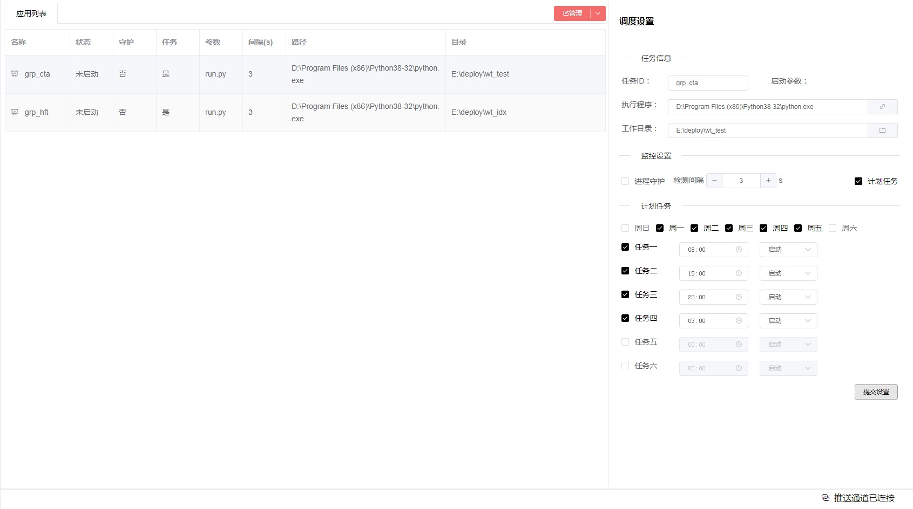
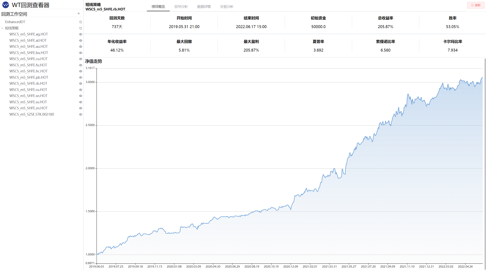
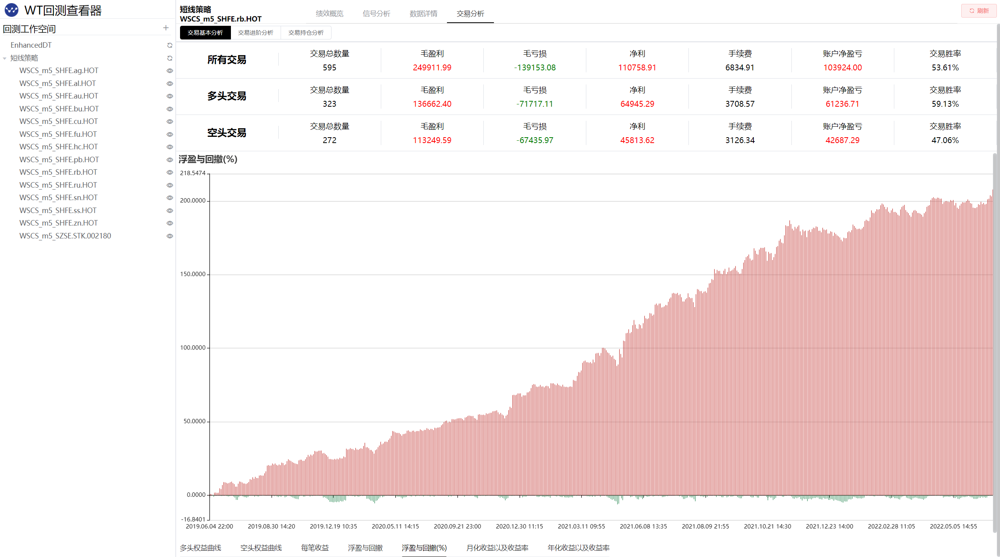
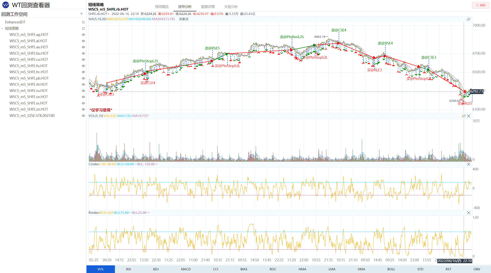
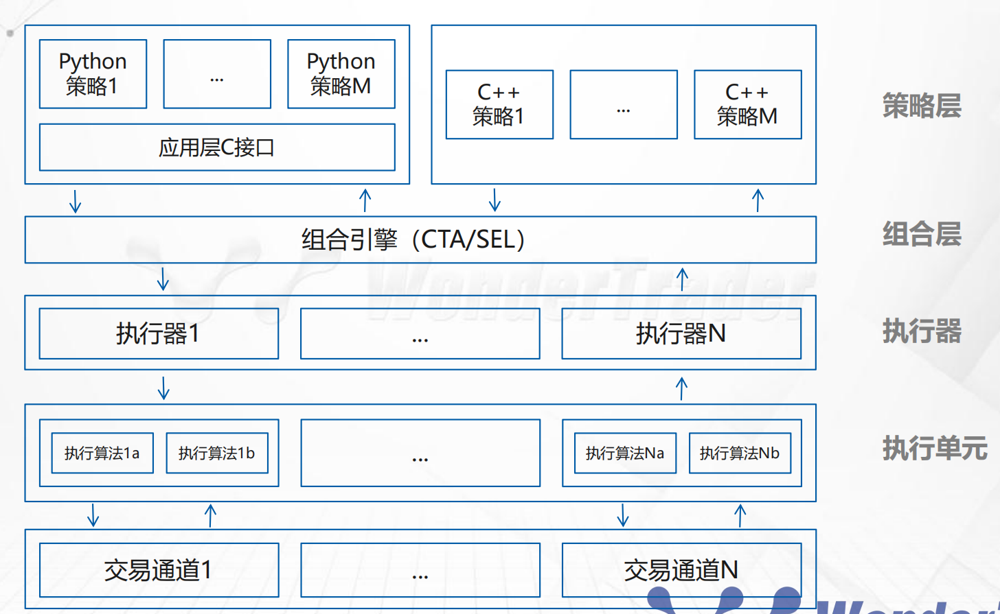

<p align="center">
    
    
    
    
</p>

#### *WonderTrader*是什么
* `WonderTrader`是一个基于`C++`核心模块的，适应全市场**全品种**交易的，**高效率**、**高可用**的量化交易开发框架。
    - **面向于专业机构的整体架构**
    - **数十亿级的实盘管理规模**
    - 从数据落地清洗、到回测分析、再到实盘交易、运营调度，**量化交易所有环节全覆盖**
* `WonderTrader`依托于高速的`C++`核心框架，高效易用的应用层框架（[wtpy](https://github.com/wondertrader/wtpy)），致力于打造一个从研发、交易、到运营、调度，全部环节全自动一站式的量化研发交易场景。
* `WonderTrader`于`0.9`开启了一个新的**UFT引擎**，针对超低延时交易的需求进行实现，经过一系列的优化以后，系统延迟在**175纳秒**之内。


* `WonderTrader`的实盘运行架构
    

#### `WonderTrader`的优势
* **丰富的交易引擎**
    > - **CTA引擎**，也叫**同步策略引擎**，一般适用于标的较少，计算逻辑较快的策略，事件+时间驱动。典型的应用场景包括单标的择时、中频以下的套利等。Demo中提供的DualThrust策略，单次重算平均耗时，Python实现版本约70多微秒，C++实现版本约4.5微秒。
    
    > - **SEL引擎**，也叫**异步策略引擎**，一般适用于标的较多，计算逻辑耗时较长的策略，时间驱动。典型应用场景包括多因子选股策略、截面多空策略等。
    > - **HFT引擎**，也叫**高频策略引擎**，主要针对高频或者低延时策略，事件驱动，**系统延迟在1-2微秒之间**
    > - **UFT引擎**，也叫**极速策略引擎**，主要针对超高频或者超低延时策略，事件驱动，**系统延迟在200纳秒之内**
    
    
* **完善的开发接口**
    > - **高效易用的数据接口**：每个策略都会有独立的上下文模块，上下文会自动缓存策略所需要的数据，策略直接调用即可。
    > - **简洁的信号接口**：策略只需要设置目标仓位，后台自动执行。
    > - **上下文无关的策略逻辑**：策略不需要自己记录任何数据，每次只需要向接口查询即可，数据全部缓存在内存中，访问效率有保障。

* **专业的策略管理**
    > - **策略组合统一管理**：采用策略组合的方式，主要为了配合专业机构的产品管理。一个组合盘，对应若干个策略的若干个标的，再设置一个基本的单位资金量，这就是产品管理的基本组合盘，方便扩展。
    > - **目标仓位合并执行**：目标仓位合并以后，避免了自成交的风险，同时降低了保证金占用和佣金开销。
    > - **理论部位独立存储**：策略的理论部位是独立存储的，组合盘的整体绩效也是独立核算的，轻松胜任内部管理。
    > - **多账户并发执行**：组合的目标头寸确定以后，就通过多个交易通道同步执行，可以有效的保障不同的账户的绩效的一致性。

* **全类型的回测支持**
    > - **语言支持全**：不论是`C++`开发的策略还是`wtpy`下开发的`python`策略，或者其他语言子框架下开发的策略，都在**统一的回测引擎**中统一回测。
    > - **回测效率高**：回测引擎采用`C++`开发，回测效率高，速度快。不管是`C++`策略还是`Python`策略，都能快速验证。
    > - **策略支持完备**：除了**CTA策略**、**SEL策略**可以回测，**HFT策略**、**UFT策略**和**执行单元**也能回测
    

* **高效的数据伺服**
    > - **本地数据伺服**：`WonderTrader`内置的存储引擎采用本地存储，在本地建立数据伺服，通过`udp`端口广播实时行情，实现`1+N`的服务结构，可以同时向多个组合盘提供无差别数据服务。专业数据供应商级别的架构，支持搭建多级分发体系，轻松应对各种需求场景。
    > - **缓存历史数据**：交易过程中，历史数据全部缓存到内存中，同时采用内存直接引用内存数据切片的机制，从根本上避免数据拷贝，提高访问效率。
    > - **高效存储引擎**：实时数据采用`mmap`文件，读写高速并且不会丢失数据。同时支持mysql数据库存储历史数据，更方便在此基础上搭建自有的投研数据库。

* **灵活的风险控制**
    > - **组合盘资金风控**：组合盘有预设的资金规模，可以针对组合盘的虚拟资金，进行组合盘的资金风控。最大的优点是，如果组合盘处于下行阶段，触发风控以后，即使资金账户没有打到风控线，也不会再继续下行了。
    > - **通道流量风控**：主要针对**合规风险**，控制的是总撤单笔数、短时间内下单次数和撤单次数等指标。
    > - **账户资金风控**：和一般意义上的资金风控一致，主要控制账户资金的回撤等。
    > - **紧急人工介入**：提供一个紧急的人工介入的入口，通过上传一个配置文件，达到控制的目的。主要适用于单品种出现风险，如果全市场风险，人工停止系统即可。
    > - **离合器机制**：离合器机制依托于信号和执行分离的机制的，主要是如果策略或组合发生风险，通过离合器机制，直接断开信号执行。优点是不影响策略的逻辑，只断开信号的执行，可以继续观察策略在特定行情阶段的表现，和理论研究相互印证。
    

* **强大的控制台**（[wtpy](https://github.com/wondertrader/wtpy)的监控服务）
    > - **组合盘运行监控**：可以查看实时运行日志、策略理论数据、交易通道数据等，并提供手动启停的入口。
    
    > - **自动调度服务**：全自动调度定时任务（启动、停止、重启），支持按周设置任务重复，支持进程守护。
    
    > - **实时事件通知**：监控服务接收组合盘推送的事件，然后转发给监控端，提示给用户。
    > - **回测查看器**：使用WtBtSnooper模块，可以进行回测数据的查看分析。
    
    
    
    > - **全自动远程部署(在建)**：全自动在线远程部署，提供回测环境、实盘环境等多种应用场景的自动化部署服务。

#### 常见应用场景
* **团队内控**
    策略组合管理的方式，给团队内部管理提供了完美的解决方案。
    - 一方面，不同投研人员，不同的策略可以组合成一个组合运行，而且每个策略都有自己的理论部位，即使交易相同标的也不会互相干扰；
    - 另一方面，`C++`级别的代码可以提供最大的策略保密性，投研人员不用担心策略的泄露；
    - 策略的绩效是独立核算的，团队内部的考核指标可以很容易实现。

* **多账户交易**（**多产品配置**）
    对于不同行情周期下的策略组合，一般团队都会有一个当下最适应的策略组合。但是同一时期，团队可能会同时管理很多个账户，而其实这些账户用到的策略组合都是相同的。这个时候`WonderTrader`平台提供的**M+1+N执行架构**就能够完美的满足这个需求。
    
    - 首先，策略组合有自己的单位资金容量和对应的风险参数，以及各个策略的单位交易数量；
    - 其次，不同的账户有不同的资金规模和风险偏好，这个时候只需要根据这些要求配置不同的手数倍率即可；
        > 假如某组合盘P基本资金规模为500w，预期收益30%，最大回撤10%，收益风险比3:1；A账户使用该组合盘P交易，A账户的资金量为1000w，可以接受的最大回撤也是10%；B账户也使用该组合盘P交易，资金量也是1000w，但是可以接受的最大回撤为20%；这个时候因为A账户风险参数和基本盘一致，所以A账户的手数放大倍数为资金规模/基本盘的资金规模=1000w/500w=2倍；B账户因为可以忍受最大回撤20%，所以手数比例还要再放大一倍，即B账户可以配置4倍。
    - 第三，不同的账户可以配置独立的风控逻辑，账户之间不会互相影响。

* **多标的跟踪**
    一些用解释型语言（如`Python`）开发核心模块的量化交易平台，在标的数不多的情况下，能够胜任各种不同的应用场景。但是当需要跟踪的标的数达到100个以上，甚至是50个以上时，就无法满足需求了。一方面资源占用大，利用`multiprocess`等机制，虽然各个标的独立运行，但是上百个标的就要新建上百个进程，内存和CPU开销都非常大；另一方面策略效率低，资源争强严重的情况下，策略反应也会变慢。
    `WonderTrader`核心采用`C++`开发，数据伺服更是一开始就设计成向多个组合同时提供服务的架构，同时策略和执行剥离，信号执行和策略计算完全在两个不同的线程中独立运行。在这样的架构下，就能够很好的满足多标的跟踪的需求。

* **大计算量策略**
    一些策略计算量会非常惊人，比较典型的就是选股策略，不管是用多因子也好，还是基本面也好，都会从数千只股票中，逐步筛选，从而得到最后的目标股池。另外，一些多标的的多因子框架也具有较大的计算量。这样的策略，计算量非常庞大，耗时也长。
    `WonderTrader`的`SEL`引擎就是为了满足这方面的需求而定制的。`SEL`引擎采用异步时间驱动的模式，通过向引擎注册重算时间调度（支持日内，每日、每周、每月的等多种周期），定时触发重算，然后调整多标的的目标仓位，从而输出信号。

* **极速交易**
    `WonderTrader`使用`C++`作为底层核心开发语言，一个最重要的目的就是**追求极致性能**，所以`WonderTrader`的使用场景中**高频交易**或者**极速交易**有一个非常大的占比。`WonderTrader`于`v0.9`版本开设了一个新的**UFTEngine**，专门针对极速交易的场景。
    和原来的`HFTEngine`不同，`HFTEngine`针对的是一般高频，侧重于**向应用层提供高性能的底层组件**，会考虑更多的兼容性问题以及应用层对接的问题，**系统延迟在1-2微秒之间**。而`UFTEngine`则完全从`WtCore`项目剥离，不向应用层提供接口，全部在`C++`进行开发实现，**系统延迟在200ns以内**。

* **算法交易**
    `WonderTrader`有一个独立的执行器入口模块`WtExecMon`，用户可以在此基础上实现算法交易。`WonderTrader`的**M+1+N**执行架构中，**1+N**执行部分剥离出来，就可以作为一个**独立算法交易执行器**来使用。用户在使用的时候，通过设置指定标的的目标头寸，算法执行单元就可以按照预设的算法进行交易下单。
    用户可以通过实现自己的`WtExecFact`模块，来添加更多的算法执行单元。高效的`C++`底层，可以给算法执行单元的执行效果提供有力的保障。

#### 支持的交易接口
* 期货
    * CTP
    * CTPMini
    * 飞马Femas
    * 艾克朗科（仅组播行情）
    * 易达
* 期权
    * CTPOpt
    * 金证期权maOpt
    * QWIN二开
* 股票
    * 中泰XTP
    * 中泰XTPXAlgo
    * 华鑫奇点
    * 华锐ATP
    * 宽睿OES

#### `wtpy`简介
* [wtpy](https://github.com/wondertrader/wtpy)是构建在`WonderTrader`核心模块之上的，使用`Python3`开发的`WonderTrader`的`Python3`子框架
* `Python`作为量化领域最流行的语言，在时序数据处理上有许多非常受欢迎的强大的第三方库
* `Python`作为一种解释型语言，代码编写和调试都非常方便，不需要编译就可以直接运行
* `Python`的跨平台属性也使`Python`可以应用到更多的场景中
* `wtpy`主要功能是作为`WonderTrader`在`Python`语言的外延
* 同时`wtpy`还内置了一个强大的监控服务组件`WtMonSvr`。该组件提供了远程的`webui`的监控界面，可以实时监控策略组合的运行情况，还提供全天`24×7`的自动调度服务，为你的交易保驾护航。

#### `WonderTrader`怎么获取
* `WonderTrader`
	- `github`地址：<https://github.com/wondertrader/wondertrader>
	- `gitee`地址：<https://gitee.com/wondertrader/wondertrader>
* `wtpy`
	- `github`地址：<https://github.com/wondertrader/wtpy>
	- `gitee`地址：<https://gitee.com/wondertrader/wtpy>
* `wtpy`获取地址：<https://pypi.org/project/wtpy/>
    `wtpy`可以直接在`python3.8`以上的版本安装
    ``` shell
    pip install wtpy --upgrade
    ```

#### `WonderTrader`延伸项目
* 将`wtpy`作为底层回测引擎的强化学习框架`Wt4ElegantRL`
<https://github.com/drlgistics/Wt4ElegantRL>


#### 写在最后
* * *
* 关注公众号`wondertrader`，可以收到`WonderTrader`的实时资讯
* 用户交流QQ群上线：一群`610730738`(已满)   二群`367916500` (加入前请先`star`一下, 然后提供`github`用户名)
* 更多`WonderTrader`的文档请看<https://docs.wondertrader.com/>
* `WonderTrader`半官方文档 <https://dumengru.github.io/docs_wondertrader/>
* @ZzzzHeJ的`WonderTrader`学习笔记<https://zzzzhej.github.io/WonderTrader-Learning-Notes/>
